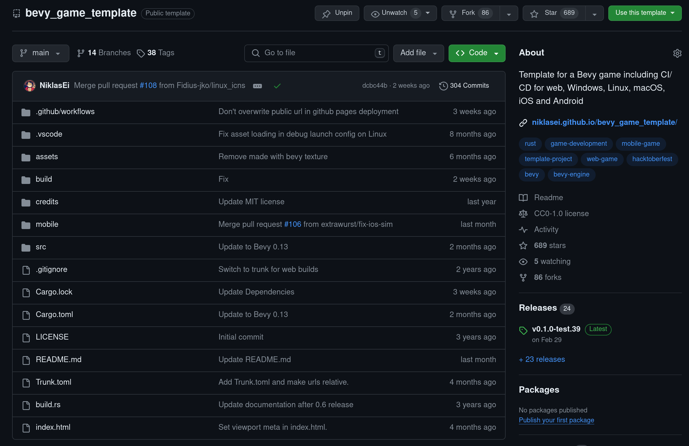

# Learnings from a Bevy game template

---

# A third-party starting point for Bevy apps

- cross-platform
- CI/CD
- extendable

---

# Cross-platform setup

- Support for all "official" Bevy platforms
- Minimal structure with two crates
- Build files per platform

---

# Automation is everything

- Simple CI pipeline
- Build pipeline for all target platforms
- Publish pipelines for web, android and iOS

---

# Extendable

- Embrace Bevy plugins for structure
- Add more crates to the workspace

---

# general structure

think by domain, not type
player plugin in own mod, not all systems in one, all resources in another

---

# loading state?

---

# Some patterns deserve their own crates

- loading state -> bevy_asset_loader

---

# cross-platform things in code

* Turn off the windows dev console
* `build.rs` file for exe icon
* `window.set_window_icon()` to set the icon in the task bar/window on Windows and Linux

[//]: # (ask to use gnu toolchain so players don't have to install the Microsoft C/C++ Runtime Redistributables?)

---

# excursion: wasm-opt?

---

# excursion: AAB builds?